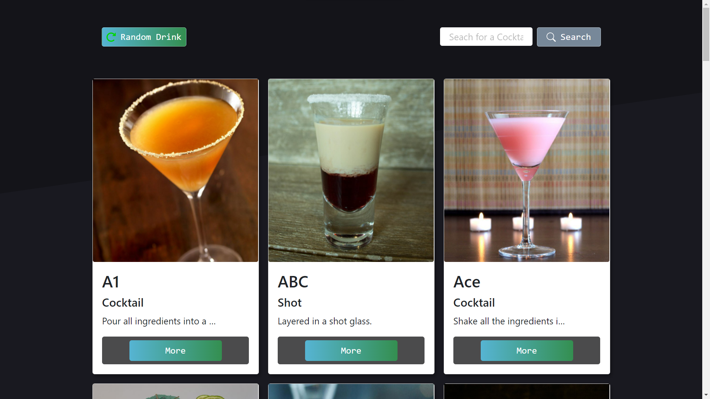

<h1 align="center">Desafio Ubistart</h1>
<!-- <h2 align="center">Rocketseat - Ignite - ReactJS</h2> -->

<!-- <h3 align="center">Chapter #2 - Challenge #2</h3> -->

  <a href="#-Project">Projeto</a>&nbsp;&nbsp;&nbsp;|&nbsp;&nbsp;&nbsp;
  <a href="#hammer_and_wrench-Features">Features</a>&nbsp;&nbsp;&nbsp;|&nbsp;&nbsp;&nbsp;
  <a href="#-Technologies">Tecnologias</a>&nbsp;&nbsp;&nbsp;|&nbsp;&nbsp;&nbsp;
  <a href="#-How-to-execute">Como usar</a>&nbsp;&nbsp;&nbsp;|&nbsp;&nbsp;&nbsp;
  <a href="#-Licence">Liceça</a>

  

#

## 💻 Projeto

Esta aplicação foi desenvolvida em React com Typescript para cumprir o desafio proposto na entrevista de emprego da empresa Ubistart.  

## :hammer_and_wrench: Features

- [x] Consumir endpoint [TheCocktailDB](https://www.thecocktaildb.com/api.php)
- [x] Criar um nome para aplicação
- [x] Sistema de busca conforme o [TheCocktailDB](https://www.thecocktaildb.com/api.php)
- [x] Fluxo: categoria, drinks, detalhes dos drinks
- [x] Sistema de pesquisa de bebidas de forma aleatória 
- [x] Busca por nome do drink
- [x] Validação por nomes de drinks errados
- [x] Sistema de rotas

## ✨ Tecnologias

Este projeto foi desenvolvido com as tecnologias abaixo:

- [React](https://reactjs.org)
- [Typescript](https://www.typescriptlang.org/)
- [React Icons](https://react-icons.github.io/react-icons)
- [React Router DOM](https://reactrouter.com)
- [React Bootstrap](https://react-bootstrap.github.io/)
- [React-Toastif](https://fkhadra.github.io/react-toastify/introduction)
- [Sass](https://sass-lang.com/)
- [Axios](https://axios-http.com)

## 🚀 Como executar o projeto

- Clone o repositório
- Instale as dependências com `yarn`
- Execute a aplicação com `yarn start`
- Acesse [`localhost:3000`](http://localhost:3000) no seu navegador

## 📄 Licence

Este projeto está sob a licença MIT abaixo. Leia sobre [LICENSE](./LICENSE) para mais informações.

---

Desenvolvido por Samael Melo 
