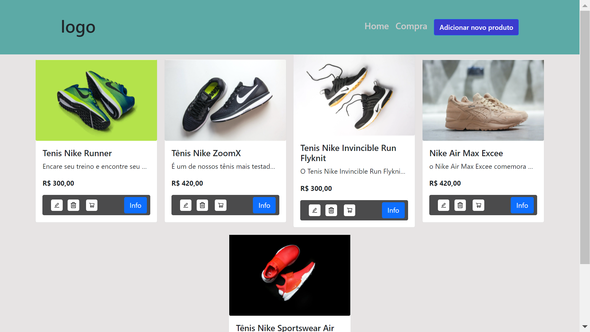
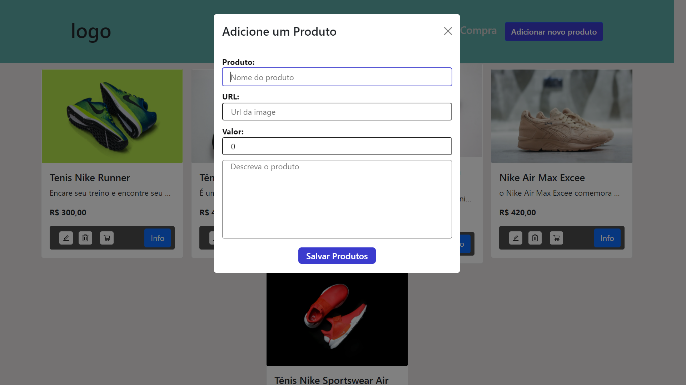

<h1 align="center">Desafio Dev</h1>
<!-- <h2 align="center">Rocketseat - Ignite - ReactJS</h2> -->

<!-- <h3 align="center">Chapter #2 - Challenge #2</h3> -->

  <a href="#-Project">Projeto</a>&nbsp;&nbsp;&nbsp;|&nbsp;&nbsp;&nbsp;
  <a href="#hammer_and_wrench-Features">Features</a>&nbsp;&nbsp;&nbsp;|&nbsp;&nbsp;&nbsp;
  <a href="#-Technologies">Tecnologias</a>&nbsp;&nbsp;&nbsp;|&nbsp;&nbsp;&nbsp;
  <a href="#-How-to-execute">Como usar</a>&nbsp;&nbsp;&nbsp;|&nbsp;&nbsp;&nbsp;
  <a href="#-Licence">Licença</a>

  

#

#

<!-- <video src="./src/assets/App.mp4" width="100%" autoplay></video> -->

## 💻 Projeto

Esta aplicação foi desenvolvida em ReactJS para cumprir o desafio proposto na entrevista de emprego. Encontrei alguns contratempos em minha máquina quando fui utilizar o banco de dados MYQSL, diante disso optei por usar a tecnologia JSON-SERVER que possibilita criar uma REST API. Para consumir esta API utilizei a tecnologia AXIOS que é uma excelente cliente HTTP que possibilita fazer o CRUD da aplicação.   

## :hammer_and_wrench: Features

- [x] Lista dos produtos cadastrados 
- [x] Criar Produtos
- [x] Editar Produtos Existentes
- [x] Deletar Produtos

## ✨ Tecnologias

Este projeto foi desenvolvido com as tecnologias abaixo:

- [React](https://reactjs.org)
- [JavaScript](https://www.javascript.com/)
- [JSON Server](https://github.com/typicode/json-server)
- [Axios](https://axios-http.com)
- [React Icons](https://react-icons.github.io/react-icons)
- [React Router DOM](https://reactrouter.com)
- [Sass](https://sass-lang.com/)
- [React Bootstrap](https://react-bootstrap.github.io/)

## 🚀 Como executar o projeto

- Clone o repositório
- Instale as dependências com `yarn`
- Execute o comando `yarn server`
- Execute a aplicação com `yarn start`
- Acesse [`localhost:3000`](http://localhost:3000) no seu navegador

## 📄 Licence

Este projeto está sob a licença MIT abaixo. Leia sobre [LICENSE](./LICENSE) para mais informações.

---

Desenvolvido por Samael Melo 
